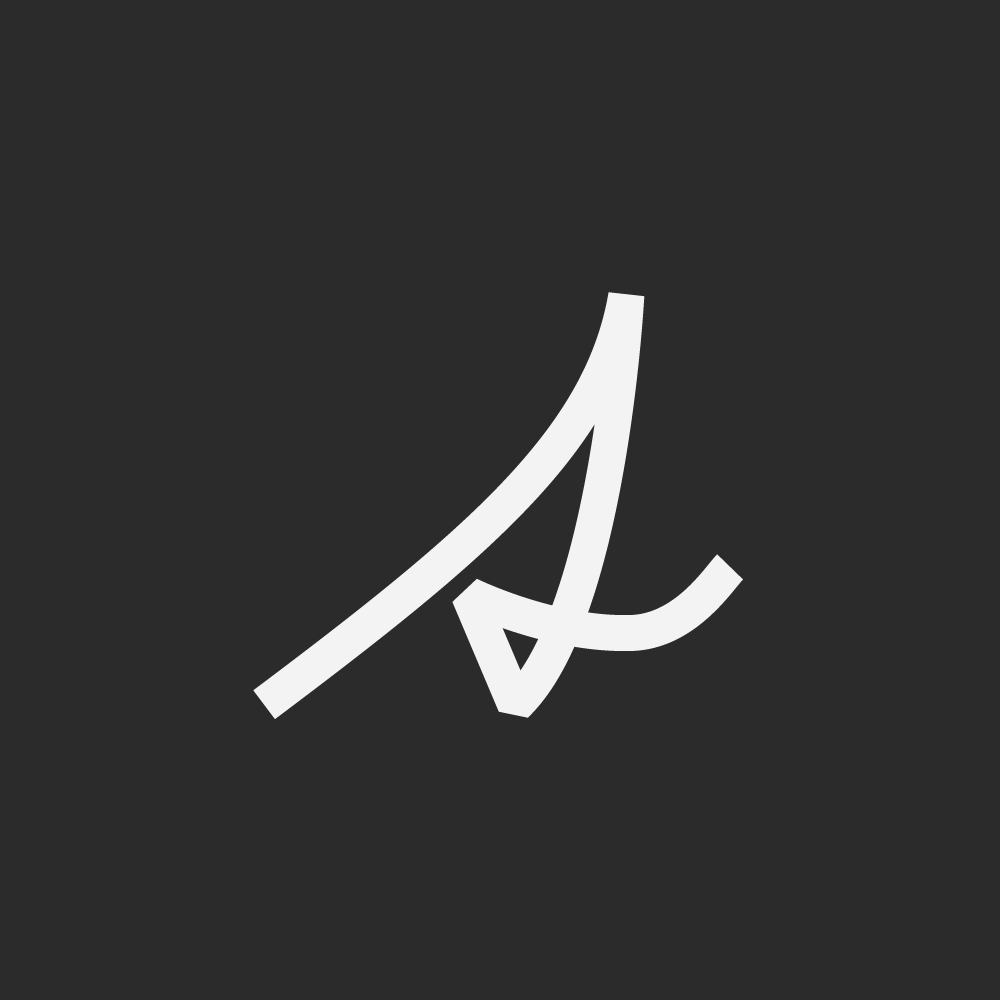
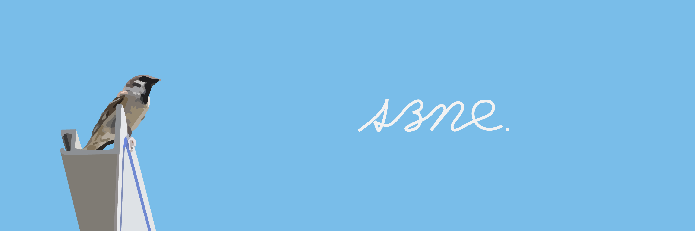
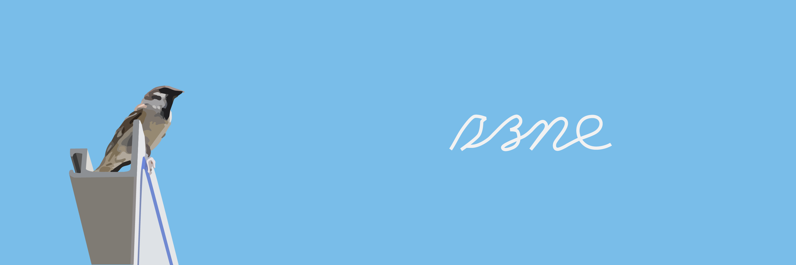
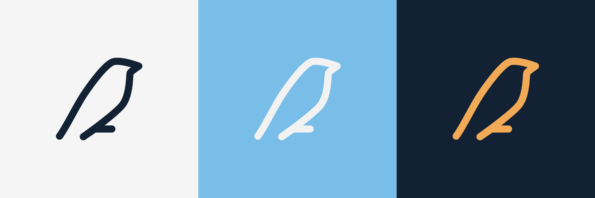

szne のロゴ（3代目）です。

### 使用したもの

- Adobe illustrator

# このロゴができるまで

## 初代ロゴ

一番最初のアイコンは、筆記体の"s"をもじったもので、3年ほど使用していました。

文字がつながっているという筆記体の特徴を生かし、残りの"zne"部分も作成したいと考えていましたが、受験勉強で忙しくなり、創作活動を行える時間的余裕がなくなってしまったことから作成することはできませんでした。

## 2代目ロゴ

受験勉強が終了した私は、活動を再開する足がかりとしてロゴの残りの部分を作成しようと考えました。

そこで、初代ロゴの.aiファイルがあるフォルダを開いてみたところ、3年前に没案にしたスズメのアイコンのたたき台を発掘しました。

当時、自身がシンプルなロゴをアイコンにすることに飽きていたことと、スズメのアイコンの出来が思ったよりも良かったので、アイコンとロゴを別々のものにすることを決意します。

## 3代目ロゴ

2代目のロゴには満足していましたが、これではアイコンとロゴの連続性が失われてしまいます。また、デザインした年代の違いからか、どうしても各文字のとげとげしさが異なっているように感じました。

そこで、sの部分をアイコンを模して作成し、"zne"部分と結合して3代目のロゴが完成しました。

# Gallery

