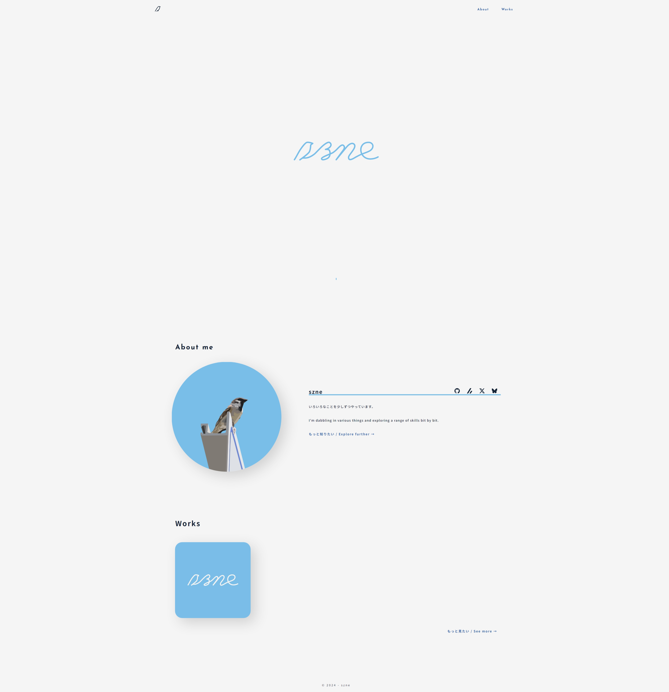
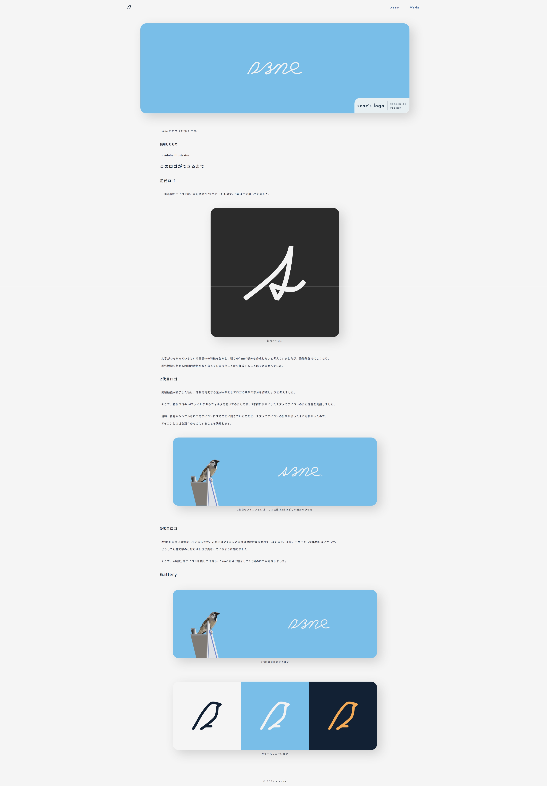
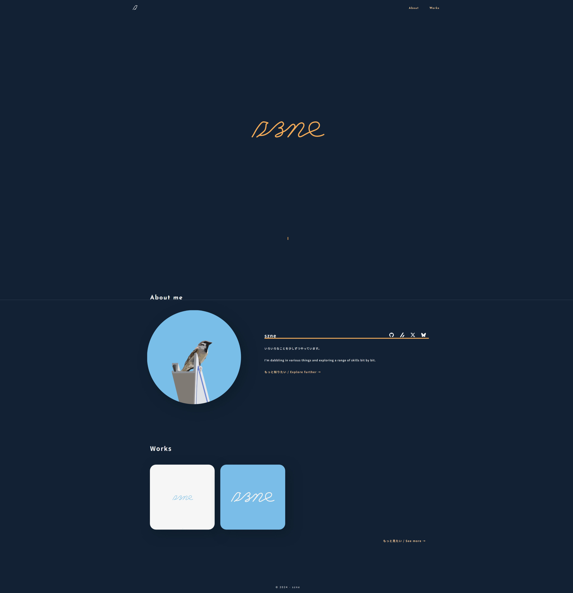
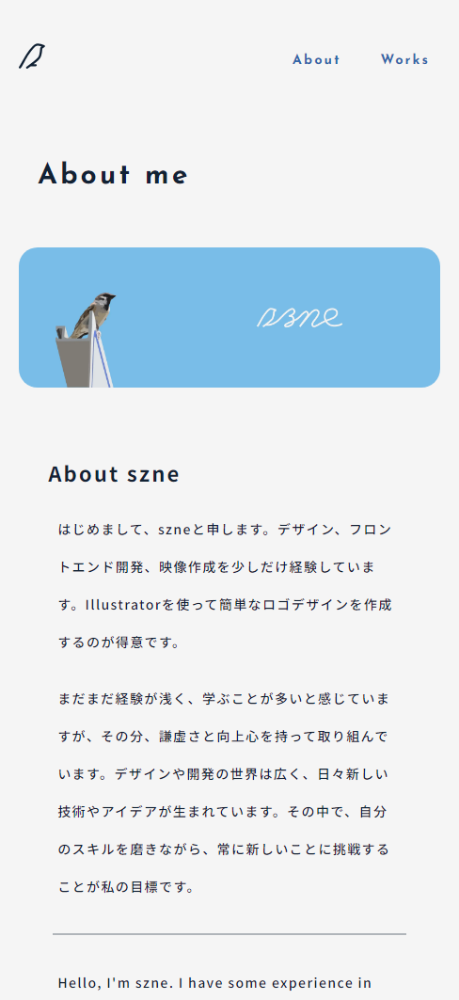

szne のホームページです。

### 使用したもの

- Next.js

# このサイトについて

私のポートフォリオサイト兼next.js練習用に作成したサイトです。
CSSフレームワークはよくわからなかったので使いませんでした、、
デザインは昔作ったサイトを参考にしつつ、よりモダンなデザインとなるように作成しました。

[ソースコード（GitHub）](https://github.com/szne/szn.jp)

## こだわったところ

- ダークモード対応
- レスポンシブデザイン
- トップページのロゴ
- その他にもいっぱい

## 改善したいところ

- Gitの使い方
- CSSの上手な使い方
- ディレクトリ構成他

# Gallery

